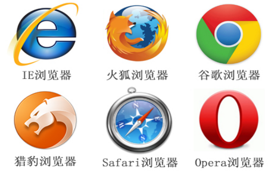
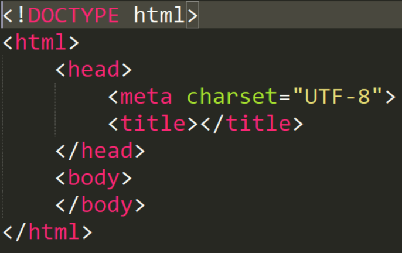

# HTML标签及规范 #

## 1.学习目标 ##
1.1  了解HTML的文件结构&基本标签使用 
1.2  熟练掌握HTML常用标签的使用 
1.3  行级元素与块级元素的使用 
1.4  熟悉HTML标签嵌套规则 

### 1.1.1 html介绍 ####

1.什么是 HTML？ 

1.1 HTML 是用来描述网页的一种语言。HTML 指的是超文本标记语言 (Hyper Text MarkupLanguage) 
1.2 HTML 不是一种编程语言，而是一种标记语言 (markuplanguage) 
1.3 标记语言是一套标记标签 (markup tag) 
1.4 HTML 使用标记标签来描述网页 
1.5 标记语言不用于向计算机发出指令，常用于格式化和链接。  
1.6 脚本语言介于标记语言和编程语言之间，脚本语言脚本语言不需要编译，可以直接用，由解释器来负责解释。  
1.7 编译型语言写的程序执行之前，需要一个专门的编译过程，把程序编译成为机器语言的文件，比如exe文件，以后要运行的话就不用重新翻译了，直接使用编译的结果就行了（exe文件），因为翻译只做了一次，运行时不需要翻译，所以编译型语言的程序执行效率高。 
1.8各种动态语言，如ASP、PHP、CGI、JSP等，都是脚本语言。计算机语言总的来说可以分成机器语言，汇编语言，高级语言（就是你所想的程序语言，如：VB，C,C++,C#,JAVA,Dephi..）三大类。

2.什么是浏览器? 

五大浏览器：IE，FireFox，Chrome，Opera，Safari（Apple）  
 
2.1 Trident内核代表产品IE,又称为IE内核。是微软开发的一种排版引擎。使用Trident渲染引擎的浏览器有:IE，遨游,世界之窗浏览器，腾讯TT等等。  
2.2 Gecko内核代表产品MozillaFirefoxGecko是一套开源的，C++编写的排版引擎。使用它最著名的浏览器有Firefox,Netscape6至9。  
2.3 WebKit内核代表产品有Safari，主要用于MacOS系统。使用它的浏览器是Safari和谷歌浏览器Chrome。  
2.4 Presto内核代表产品OperaPresto是由OperaSoftware开发的浏览器排版引擎。使用它著名浏览器是Opera。  

### 1.1.2 HTML发展史 ####

1.HTML的简介 
1.1 HTML的概念HTML是Hypertext MarkupLanguage（超文本标记语言）的缩写，是一种基于SGML（标准通用标记语言）的标记语言，是Web用于编辑网页的主要工具。在网上，如果要向全球范围内出版和发布信息，需要有一种能够被广泛理解的语言，即所有的计算机都能够理解的一种用于出版的“母语”。WWW是环球信息网的缩写，所使用的出版语言就是HTML语言。 

2.HTML的功能 
2.1 展示在线的文档，其中包含了标题、文本、表格、列表以及照片等内容。 
2.2 通过超链接检索在线的信息。 
2.3 为获取远程服务而设计表单，可用于检索信息、定购产品等。 
2.4 在文档中直接包含电子表格、视频剪辑、声音剪辑以及其他的一些应用。 

3.历次版本 
3.1 HTML1.0——在1993年6月作为互联网工程工作小组（IETF）工作草案发布（并非标准）； 
3.2 HTML2.0——1995年11月作为RFC 1866发布，在RFC2854于2000年6月发布之后被宣布已经过时； 
3.3 HTML3.2——1996年1月14日，W3C推荐标准 
3.4 HTML4.0——1997年12月18日，W3C推荐标准； 
3.5 HTML4.01——1999年12月24日，是在HTML4.0基础上的微小改进W3C推荐标准； 
3.6 HTML5——的第一份正式草案已于2008年1月22日公布,仍继续完善。 

### 1.1.3 HTML与互联网介绍 ####

1.互联网（英语：Internet），又称网际网络，或者音译因特网、英特网，是网络与网络之间所串连成的庞大网络，这些网络以一组通用的协议相连，形成逻辑上的单一巨大国际网络。 

2.HTML超文本标记语言（Hyper Text Mark-upLanguage）是一种制作万维网页面的标准语言，它是目前网络上应用最为广泛的语言，也是构成网页文档的主要语言。HTML文件是由HTML命令组成的描述性文本，HTML命令可以说明文字、图形、动画、声音、表格、链接等。 

3.HTML文件的结构包括头部（Head）、主体（Body）两大部分，其中头部描述浏览器所需的信息，而主体则包含所要说明的具体内容。 

### 1.1.4 HTML基本结构 ####

 

1.文档介绍 

1.1 html称为根元素，所有的网页元素都在<html></html>中。 
1.2 head元素用于定义文档的头部。 
1.3 head元素用于定义网页显示的内容。 
1.4 html开始标签  /html结束标签 

2.文档元素介绍

2.1 html根元素（网页中最大的标签） 
2.2 head元素HTMLhead 。头部元素有:meta,title,link,script 
2.3 title文档标题HTML中title 标签定义文档的标题。title 元素在所有 HTML/XHTML 文档中都是必需的。title 元素能够：定义浏览器工具栏中的标题提供页面被添加到收藏夹时显示的标题显示在搜索引擎结果中的页面标题。 
2.4 meta网页信息说明HTML （meta） 元素元数据（metadata）是关于数据的信息。（meta） 标签提供关于 HTML文档的元数据。元数据不会显示在页面上，但是对于机器是可读的。典型的情况是，meta元素被用于规定页面的描述、关键词、文档的作者、最后修改时间以及其他元数据。meta 标签始终位于 head 元素中。元数据可用于浏览器（如何显示内容或重新加载页面），搜索引擎（关键词），或其他 web 服务。针对搜索引擎的关键词一些搜索引擎会利用 meta 元素的 name 和 content属性来索引您的页面。 
2.5 body标签的置放处，所有的标签都会放在body里面

3.css和js简介 
css网页的修饰，js脚本语言，做动效和功能 

### 1.1.5 HTML标签 ####

1.标签分类 
1.1 单标记指的是由一个标签组成， 
比如：换行符：br，水平线：hr，图片标签:img，文本标签:input，链接：link， 

1.2 双标记指的是由“开始标签”和“结束标签”两部分构成，必须成对使用。 
如p段落标签，其中
是开始标签表示一个段落的开始，/p是结束标签，表示一个段落的结束 

1.3 p:段落   h1-h6:标题  br:换行 hr：水平线  

1.4 文本格式化 

b粗体  strong粗体  
strong标签与b标签都表示粗体。但strong表示强调。 
例如，一个单词或短语需要显示得更高调，更响亮...总之要比一般文本更加突出。这里我们就使用strong标签在SEO中的应用，告知搜索引擎我们内容强调的是什么。 
i斜体 em斜体 
HTML em标签告诉浏览器把其中的文本表示为强调的内容。 
pre预格式化文本保留空格与换行 
small更小的文本 
bdo 文字方向 
dir 
ltr左到右 
rtl右到左 
指定文本方向的属性值(ltr左到右, rtl右到左) 
sub下标文本 
sup上标文本 
img图片 
定义：img 元素向网页中嵌入一幅图像。 
用法: 
img src="url地址" alt="替代文本" 
alt属性：规定图像的替代文本。 
src属性：规定显示图像的 
URL。url为图片的相对路径或者绝对路径均可。 
a链接：普通的链接: a href="http://www.baidu.com/" 

### 1.1.6 HTML块元素&行内元素 ####

1.HTML div 标签 
div定义文档中的分区或节HTML，div元素是块级元素，它是可用于组合其他HTML元素的容器。div元素没有特定的含义。由于div是块级元素，浏览器会在其前后显示折行。div元素可用于对大的内容块设置样式属性。div元素的另一个常见的用途是文档布局。它取代了使用表格定义布局的老式方法。使用table元素进行文档布局不是表格的正确用法。table元素的作用是显示表格化的数据。 

2.HTML span标签 
span标签用来组合文档中的行内元素span元素是内联元素，可用作文本的容器。span元素也没有特定的含义。span没有固定的格式表现，当对它应用样式时，它才会产生视觉上的变化。 
HTML标签包括块级标签(block)与行内标签(inline) 

3.标签定义 
1.1 块级元素一般用来搭建网站架构、布局、承载内容……它包括以下这些标签：address、dir、div、dl、dt、dd、fieldset、form、h1~h6、hr、menu、noframes、ol、p、pre、table、ul 
1.2 内嵌元素(内联元素，行内元素)一般用在网站内容之中的某些细节或部位，用以“强调、区分样式、上标、下标、锚点”等等，下面这些标签都属于内嵌元素：a、b、bdo、big、small、br、cite、em、font、i、img、input、kbd、
label、select、span、strong、sub、sup、textarea 

4.HTML实体转义 
&lt; 等同于 < 
&gt; 等同于 > 
&amp;等同于& 
&nbsp;空格 

### 1.1.7 W3c规范&标签嵌套规则 ####

1. W3c规范 
Q1：什么是W3C？ 
万维网联盟(world wideweb)。简单的说就是一个国际性的中立组织，专门负责统一web相关的各项标准。 
Q2：为什么要统一web标准？ 
试想你用湖北话交流，他用广东话交流，你们是永远都无法进行畅通的沟通。所以这个时候“普通话“就出现了！它能够促使你们畅通的交流，互相理解彼此的意图。这里的不同话种其实就是不同浏览器的解析规则，而你想表达的意思就是浏览器的解析结果。因此，不同的浏览器想要解析出相同的内容呈现给用户，就需要有一个统一标准的解析规则。这就是W3C出现的缘由。 

2.为啥使用语义化标签? 
2.1 更容易被搜索引擎收录。 
2.2 更容易让屏幕阅读器读出网页内容。 
2.3 能够更好的体现页面的主题 
2.4 兼容性更好，支持更多的网络设备 
例如： 
q标签:短文本引用，注意要引用的文本不用加 双引号，浏览器会对q标签自动添加双引号 
blockquote标签:长文本引用，注意浏览器对 blockquote标签的解析是 缩进样式 
address标签:为网页加入地址信息 
caption标签:为表格添加标题和摘要 
摘要的内容是不会在浏览器中显示出来的。它的作用是增加表格的可读性(语义化)，使搜索引擎更好的读懂表格内容，还可以使屏幕阅读器更好的帮助特殊用户读取表格内容。 
3.HTML标签嵌套规则 
3.1 块元素可以包含内联元素或某些块元素，但内联元素却不能包含块元素，它只能包含其它的内联元素。（a标签例外） 
3.2 块级元素不能放在p里面 
3.3 有几个特殊的块级元素只能包含内嵌元素，不能再包含块级元素，这几个特殊的标签是：h1、h2、h3、h4、h5、h6、p、dt 
3.4 块级元素与块级元素并列、内嵌元素与内嵌元素并列 
4.纽曼企业官网命名规范 
企业站: 
1.首页 index.html 
2.公司介绍 about_us.html 
3.新闻列表 news.html 
4.新闻列表详情页 news_center.html 
5.产品列表 product.html 
6.产品详情页 pro_details.html 
7.联系我们 contact_us.html 
搭建项目主体结构 
纽曼企业官网排版分为头部，中部，尾部三大部分 
div class="header" 
div class="middle" 
div class="footer" 
