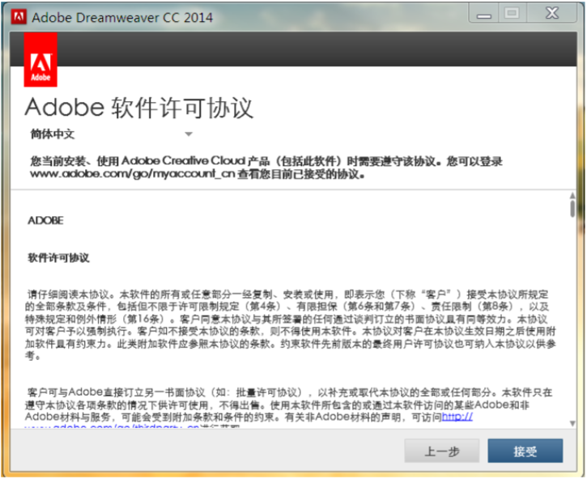
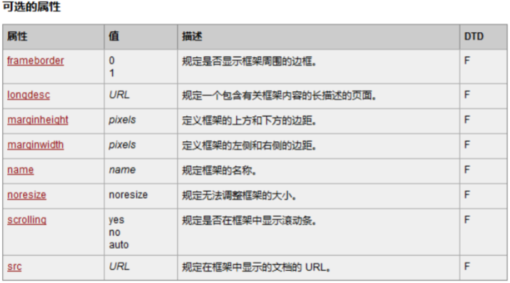
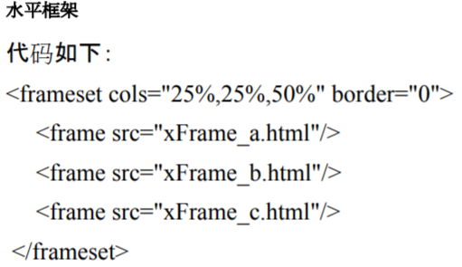

# 表格表单html框架 #

## 1.学习目标 ##
1.1  DW工具的安装&使用 
1.2  HTML表格使用 
1.3  HTML框架 
1.4  HTML表单&文本域使用 

### 1.2.1 Dreamweaver工具的使用 ####

1.下载安装 

1.1 下载文件并解压，运行解压程序，将其解压缩到指定目录。 
1.2 解压完成后，会自动运行安装程序。(如果没有自动运行，可以手动在解压目录中手动启动) 
1.3 初始化安装程序。在win764位系统安装会弹出这个错误信息，选择忽略，程序进入初始化安装状态，这里需要等待一会。 
 
1.4 初始化安装程序后，进入安装准备。记得先断开电脑的网络连接。选择试用进行安装。  
 
1.5 联网提示处理
1.51  程序会提示要你使用AdobeID登录，我们使用的是破解版。不需要AdobeID,选择登录。 
1.52  如果我们断开网络，程序发现已经断网，无法登录，则有“以后登录”选项。 
 
 
1.6 正式安装Adobe的软件许可协议，选择接受。 
 
1.7 安装选项的配置，点击文件路径右边的浏览按钮可以更改安装目录。(你们可以根据自己的需要改在对应目录。记住，这个目录就是破解文件需要存放的目录。) 
 
1.8 接下来程序就开始安装了，这个过程需要一点时间，耐心等待吧。安装成功。(默认是没有桌面图标的，因此你需要在开始菜单中，找到这个文件的启动目录。也可以找到文件的安装目录，在桌面创建一个快捷方式。) 
 
1.9 开始破解(实现下载好补丁文件解压)Adobe系列的产品，破解方法都是大同小异；基本上都采用了文件替换的方式进行破解。运行破解补丁。
 
1.10 选择要破解的Adobe产品;(这里我们选择Adobe Dreamweaver CC 2014(32bit))点击应用。 
 
1.11 提示“无法找到文件，查找吗？”，(因为我没有把补丁文件放在和Adobe Dreamweaver CC2014的安装目录下，所以补丁找不到我们要替换的文件)，我们点击是，进行查找。 
 
1.12 找到我们的Adobe Dreamweaver CC2014安装目录，破解补丁会自动过滤其他的文件，直接找到要替换的文件。 
 
1.13 替换这个系统的amtlib.dll的文件后，补丁提示破解完成。 

2.Dreamweaver是什么? 

历史：Dreamweaver(梦想编织者)是美国MACROMEDIA公司开发的集网页制作和管理网站于一身的所见即所得网页编辑器，后来被设计软件巨头adobe公司收购，成了adobe的子产品。它是一款优秀的所见即所得的网页设计软件利用它可以轻而易举地制作出跨越平台限制和跨越浏览器限制的充满动感的网页。Dreamweaver是一款可视化网页编辑工具，其实我们的网页就是一个超文本，超文本也在文本范畴，比如记事本新建个文件，改名以html结尾，也是一个网页Dreamweaver支持代码、拆分、设计、实时视图等多种方式来创作、编写和修改网页（通常是标准通用标记语言下的一个应用HTML）。 
 

### 1.2.2 table表格 ####

 
1.属性介绍 
1.1 thead定义表格页眉 
1.2 tbody定义表格主体 
1.3 tfoot定义表格页脚 
1.4 tr，td定义行和列，只能行里面包列 
1.5 colspan指定单元格横向跨越的列数，rowspan指定单元格纵向跨越的行数，属性(colspan指定单元格横向跨越的列数,rowspan指定单元格纵向跨越的行数) 
1.6 border设置表格边框 
1.7 width设置表格宽度 
1.8 align设置表格对齐 
1.9 cellpadding设置单元格间距 
1.10 cellspacing设置像素间隙 

2.frame属性定义和用法 
2.1 frame 属性规定外侧边框的哪个部分是可见的。从实用角度出发，最好不要规定 frame，而是使用 CSS来添加边框样式。 
2.2 void不显示外侧边框 
2.3 above显示上边框 
2.4 below显示下边框 
2.5 hsides显示上下边框 
2.6 vsides显示左右边框 
2.7 lhs显示左边框 
2.8 rhs显示右边框 
2.9 box显示所有外边框 
2.10 表格制作实例 
 
 

3.扩展 
3.1 很少使用(thead定义表格页眉, tbody定义表格主体, tfoot定义表格页脚) 
属性： 
3.2 border设置表格边框 
3.3 width设置表格宽度 
3.4 align设置表格对齐 
3.5 cellpadding设置单元格间距 
3.6 cellspacing设置像素间隙 

### 1.2.3 HTML框架 ####

1.通过使用框架，你可以在同一个浏览器窗口中显示不止一个页面。每份HTML文档称为一个框架，并且每个框架都独立于其他的框架。 

2.frameset标签定义和用法frameset元素可定义一个框架集。它被用来组织多个窗口（框架）。每个框架存有独立的文档。在其最简单的应用中，frameset元素仅仅会规定在框架集中存在多少列或多少行。您必须使用 cols或 rows 属性。 
2.1 注意事项
您不能与 frameset标签一起使用body标签。不过，如果您需要为不支持框架的浏览器添加一个noframes标签，请务必将此标签放置在body标签中！
 

3.frame标签定义和用法frame标签定义 frameset 中的一个特定的窗口（框架）。把整个页面分成几个框架，即多个frame.当你点击左侧的导航时，可以在右侧窗口中显示对应的内容。注意:每个frame对应显示一个网页内容。 
 
 
 
 
 

4.iframe标签定义和用法iframe 元素会创建包含另外一个文档的内联框架（即行内框架）。浮动框架(iframe):是镶嵌在一个网页中的另一个网页。相当网页中又嵌套了一个窗口。 
 

5.跳出框架 
a标签target属性 
定义和用法a 标签的 target 属性规定在何处打开链接文档。如果在一个 a 标签内包含一个 target属性，浏览器将会载入和显示用这个标签的 href属性命名的、名称与这个目标吻合的框架或者窗口中的文档。如果这个指定名称或 id的框架或者窗口不存在，浏览器将打开一个新的窗口，给这个窗口一个指定的标记，然后将新的文档载入那个窗口。从此以后，超链接文档就可以指向这个新的窗口。 
 

6.锚点链接（通过id）

### 1.2.4 HTML 表单 ####

1.标签类型 

1.1 input文本域 
1.2 type="text"文档框 
1.3 type="password"密码框 
1.4 type="radio"单选框 
1.5 type="checkbox"复选框 
1.6 type="file"文件框 
1.7 type="hidden"隐藏文本框 
1.8 type="button"普通按钮 
1.9 type="submit"提交按钮 
1.10 type="reset"重置按钮 
1.11 select下拉列表 
1.22 option选项 
1.23 textarea多行文本框 

2.定义和用法 

2.1 textarea 标签定义多行的文本输入控件。文本区中可容纳无限数量的文本，其中的文本的默认字体是等宽字体（通常是 Courier）。可以通过 cols 和 rows 属性来规定 textarea的尺寸，不过更好的办法是使用 CSS 的 height 和 width 属性。 
2.2 button按钮 
2.3 form表单是一个包含表单元素的区域。表单元素是允许用户在表单中（比如：文本域、下拉列表、单选框、复选框等等）输入信息的元素。表单使用表单标签form定义action定义和用法必需的 action 属性规定当提交表单时，向何处发送表单数据。method定义和用法method 属性规定如何发送表单数据（表单数据发送到 action属性所规定的页面）。表单数据可以作为 URL 变量（method="get"）或者 HTTP post（method="post"）的方式来发送。 
2.4 maxlength:最多可以输入几个字，name:给输入框取得名字，value，输入框中的值，placehold：和value类似，label：经常配合输入框使用，fieldset：框框，legend：标题 
